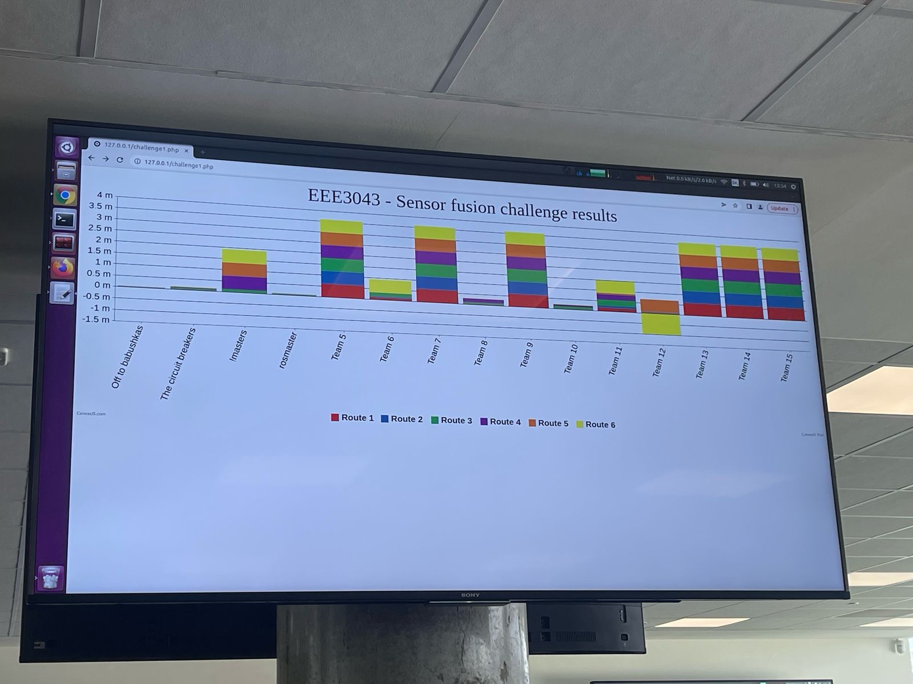

# Challenge 1: Sensor Fusion

```bash
challenge1
├── README.md
├── launch
│   └── group1_KF.launch
├── results
│   ├── carpet
│   ├── floor
│   └── noGPS
└── student_instructions_own_laptops.pdf
```
This directory contains the launch file and results for Challenge 1.
- The `results/carpet` folder contains data from running the robot on a carpet.
- The `results/floor` folder contains data from running the robot on a tile floor.

In both cases, the GPS reading (`odom1`), odometry (`odom0`), and IMU (`imu0`) are used to localize the robot. The results should be slightly better on the tile floor.

The best results were achieved when running the robot on a tile floor while completely disregarding GPS readings, based on our hypothesis that the GPS readings are not accurate.
These results can be found in `results/noGPS`.


We've also initialized the process noise covariance matrix with high uncertainty for the GPS measurements. Instead we rely more on odometry and IMU. For more details, refer to the launch file `launch/group1_KF.launch`. And for bragging rights, no one beats Off to Babushkas.
.